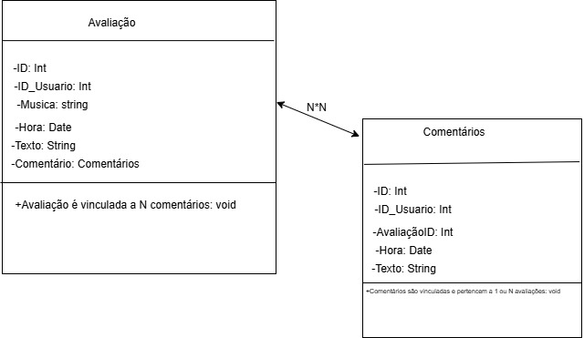
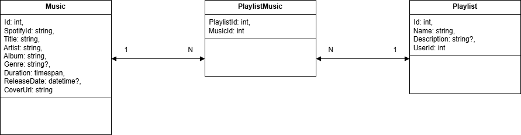

# Desenvolvimento da Aplicação

## Modelagem da Aplicação
Avaliação e Gestão de Usuário:<br>

- *Estrututura de dados no final do arquivo

Avaliação e Comentários:

- O diagrama de classes (DIAGRAMADAD.drawio) contém as classes Avaliação e Comentário, onde contém todos os atributos e funções que podem ser realizadas.

- A estrututura de dados são as duas entidades, nas quais o comentario representa uma resposta escrita feita por um usuário em relação a uma avaliação (e também uma determinada música), e a avaliação representa uma "avaliação" dada sobre uma música com suas características (por exemplo, a música, o texto da avaliação e a hora em que ocorreu).



Gestão de Músicas:



- A estrutura de dados do projeto é composta por três entidades: uma para representar as músicas armazenadas, outra para representar playlists criadas por usuários, e uma terceira que define a relação entre músicas e playlists. As explicações detalhadas de cada estrutura se encontram no final do arquivo.

Recomendação de Músicas:


- A estrutura de dados do projeto é composta por apenas uma entidade de músicas, baseada na modelagem de gestão de músicas, que armazena as músicas que serão recomendadas, com as informações básicas para recomendação por ano de lançamento, artista ou gênero.


## Tecnologias Utilizadas
### Backend 
- C# 
- API do spotify (para popular nossos dados)
- MySQL


## Programação de Funcionalidades
### Requisitos Atendidos
#### Requisitos Funcionais
|ID    | Descrição do Requisito  | Responsável | Artefato Criado | Estruturas de Dados | Teste/API | Atendido |
|------|-----------------------------------------|----|----|----|----|----|
|RF-001| A aplicação deve permitir cadastro de usuario | Yago | UsuariosController.cs | CadastroDto, Usuario | POST /api/Usuarios | ✅ |
|RF-002| A aplicação deve permitir deletar o usuario | Yago | UsuariosController.cs | Usuario | DELETE /api/Usuarios/{id} | ✅ |
|RF-003| A aplicação deve permitir alterar os dados do usuario | Yago | UsuariosController.cs | Usuario | PUT /api/Usuarios/{id} | ✅ |
|RF-004| A aplicação deve autenticar o login | Yago | UsuariosController.cs | LoginDto, Usuario | POST /api/Usuarios/login | ✅ |
|RF-005| A aplicação deve gerenciar a conexão a API do Spotify | Gustavo/Vinicius | SpotifyService.cs | SpotifyTokenDto, SearchTrackDto | GET /api/spotify/search | ✅ |
|RF-006| A aplicação deve permitir buscar por uma música        | Gustavo/Vinicius | MusicController.cs | Music, SpotifyService | GET /api/music/search?q= | ✅ |
|RF-007| A aplicação deve permitir o usuario a analisar uma musica | Daniel | Avaliação.cs| Avaliação | POST /api/Avaliacao | ✅ |
|RF-008| A aplicação deve permitir o usuario a deletar uma analise | Daniel | Avaliação.cs | Avaliação | DELETE /api/Avaliacao/{id} |✅ |
|RF-009| A aplicação deve permitir o usuario a comentar em uma analise | Daniel | Comentário.cs | Avaliação e Comentário | POST /api/Comentario | ✅ |
|RF-010| A aplicação deve permitir o usuario a deletar um comentario | Daniel | Comentário.cs | Avaliação e Comentário | DELETE /api/Comentario/{id} | ✅ |
|RF-011| A aplicação deve recomendar musicas por ano de lançamento | Carol | Artefato Criado | Estruturas de Dados | Teste/API | ✅ |
|RF-012| A aplicação deve recomendar musicas por gênero | Carol | Artefato Criado | Estruturas de Dados | Teste/API | ✅ |
|RF-013| A aplicação deve recomendar músicas por artista | Carol | Artefato Criado | Estruturas de Dados | Teste/API | ✅ |

#### Requisitos não Funcionais
|ID     | Descrição do Requisito  | Atendido |
|-------|-------------------------|----|
|RNF-001| A aplicação deve processar requisições do usuário em no máximo 3s | ✅ |
|RNF-002| A aplicação deve ser intuitiva para um uso simples | ✅ |

✅ - Atendido
❌ - Não Atendido

### Estrutura de Dados
#### Usuario
(src\Autenticação e Gestão do Usuário\Autenticacao_e_Gestao_do_Usuario\Models\Usuario) <br>
```js
{
  "id*": int,
  "nome*": "string",
  "email*": "string",
  "senha*": "string",
  "perfil": "string",
  "status": int,
  "criado_Em*": "datetime",
  "alterado_Em": "datetime"
}

- Os campos com `*` são obrigatórios.
- "perfil" deve ser "Usuario" ou "Administrador".
- "status" é um `int` que referencia uma linha da tabela `Status`.
- "criado_Em" e "alterado_Em" são definidos automaticamente pela API.
```

#### Status
(src\Autenticação e Gestão do Usuário\Autenticacao_e_Gestao_do_Usuario\Models\Status) <br>
```js
{
  "id*": int,
  "descricao*": "string",
  "criado_Em*": "datetime",
  "alterado_Em": "datetime"
}

- Os campos com `*` são obrigatórios.
- "criado_Em" e "alterado_Em" são definidos automaticamente pela API.
```

#### LoginDto
(src\Autenticação e Gestão do Usuário\Autenticacao_e_Gestao_do_Usuario\Models\DTO\LoginDto) <br>
```js
{
  "email*": "string",
  "senha*": "string",
}

- Os campos com `*` são obrigatórios.
```

#### CadastroDto
(src\Autenticação e Gestão do Usuário\Autenticacao_e_Gestao_do_Usuario\Models\DTO\CadastroDto) <br>
```js
{
  "nome*": "string",
  "email*": "string",
  "senha*": "string",
  "perfil": "string",
}

- Os campos com `*` são obrigatórios.
- "perfil" deve ser "Usuario" ou "Administrador".
```

#### AlterarUsuarioDto
(src\Autenticação e Gestão do Usuário\Autenticacao_e_Gestao_do_Usuario\Models\DTO\AlterarUsuarioDto) <br>
```js
{
  "nome*": "string",
  "email*": "string",
  "senha*": "string",
  "perfil": "string",
  "status": int,
}

- Os campos com `*` são obrigatórios.
- "perfil" deve ser "Usuario" ou "Administrador".
- "status" é um `int` que referencia uma linha da tabela `Status`.
```

#### Avaliação
(src\AvaliaçãoeComentáriosDAD\Avaliaçãoecomentários\Models\Avaliacao) <br>
```js

{
  "id*": int,
  "usuarioId*": int,
  "musica*": "string",
  "texto": "string",
  "dataCriacao*": "datetime",
  "comentarios": [ ]
}

-Os campos com * são obrigatórios.
-usuarioId referencia a tabela Usuario.
-comentarios representa uma lista de comentários vinculados à avaliação.
-dataCriacao é definido automaticamente pela API.
```

#### Comentários
(src\AvaliaçãoeComentáriosDAD\Avaliaçãoecomentários\Models\Comentario) <br>
```js

{
  "id*": int,
  "avaliacaoId*": int,
  "usuarioId*": int,
  "mensagem*": "string",
  "dataComentario*": "datetime"
}

-Os campos com * são obrigatórios.
-avaliacaoId referencia a avaliação à qual o comentário pertence.
-usuarioId indica o autor do comentário.
-dataComentario é definido automaticamente pela API.
```

#### Music
(src\Gestão de músicas\Models\Music) <br>
```js
{
  "id*": int,
  "spotifyId*": "string",
  "title*": "string",
  "artist*": "string",
  "album": "string",
  "genre": "string",
  "duration": "timespan",
  "releaseDate": "datetime",
  "coverUrl": "string"
}

- Os campos com `*` são obrigatórios.
- Ela é criada a partir de dados retornados pela API do Spotify, podendo ser buscada por ID, nome ou adicionada manualmente.
- spotifyId indica o id da música usado pela API do Spotify.
- É usada diretamente para compor playlists e para exibição ao usuário final.
```

#### Playlist
(src\Gestão de músicas\Models\Playlist) <br>
```js
{
  "id*": int,
  "name*": "string",
  "description": "string",
  "userId*": int,
  "playlistMusics": [ ]
}

- Os campos com `*` são obrigatórios.
- A entidade `Playlist` representa uma coleção de músicas agrupadas por um usuário.
- Cada playlist pertence a um único usuário (via `userId`) e pode conter múltiplas músicas por meio do relacionamento com `PlaylistMusic`.
```

#### PlaylistMusic 
(src\Gestão de músicas\Models\PlaylistMusic) <br>
```js
{
  "playlistId*": int,
  "musicId*": int
}

- Os campos com `*` são obrigatórios.
- A entidade `PlaylistMusic` é uma tabela de junção que representa o relacionamento N:N entre `Playlist` e `Music`.  
- Cada registro liga uma única música a uma única playlist.
- Essa estrutura permite que uma música esteja presente em várias playlists e que uma playlist contenha várias músicas.
```

#### Avaliação (Funções)
(src\AvaliaçãoeComentáriosDAD\Avaliaçãoecomentários\Controllers\AvaliaçãoController.cs) <br>
```js

{
[HttpGet] → Retorna todas as avaliações.  
[HttpGet("{id}")] → Retorna uma avaliação específica pelo ID.  
[HttpPost] → Cria uma nova avaliação.  
[HttpPut("{id}")] → Atualiza uma avaliação existente.  
[HttpDelete("{id}")] → Remove uma avaliação pelo ID.
}

-Utiliza o AppDbContext para acessar o banco de dados.
-Todas as ações são assíncronas (async).
-As respostas seguem os padrões HTTP (200 OK, 201 Created, 204 NoContent, 404 NotFound, 400 BadRequest).
```

#### Comentários (Funções)
(src\AvaliaçãoeComentáriosDAD\Avaliaçãoecomentários\Controllers\ComentárioController.cs) <br>
```js

{
[HttpGet] → Retorna todos os comentários.  
[HttpGet("{id}")] → Retorna um comentário específico pelo ID.  
[HttpPost] → Cria um novo comentário.  
[HttpPut("{id}")] → Atualiza um comentário existente.  
[HttpDelete("{id}")] → Remove um comentário pelo ID.
}

-Utiliza o AppDbContext para acessar o banco de dados.
-Todas as ações são assíncronas (async).
-As respostas seguem os padrões HTTP (200 OK, 201 Created, 204 NoContent, 404 NotFound, 400 BadRequest).
```

#### Music (Funções)
(src\Gestão de músicas\Controllers\MusicController.cs) <br>
```js
{
[HttpGet] → Lista todas as músicas do sistema.  
[HttpGet("{id}")] → Busca uma música localmente pelo seu ID.  
[HttpGet("search")] → Busca uma música localmente ou via Spotify.  
[HttpPost("add-by-spotify-id/{id}")] → Adiciona uma música pela ID do Spotify.  
[HttpPost("add-multiple-by-spotify-id")] → Adiciona várias músicas por ID.  
[HttpPut("{id}")] → Atualiza uma música local.  
[HttpDelete("{id}")] → Remove uma música.
}

- Utiliza o AppDbContext para acessar o banco de dados.
- Todas as ações são assíncronas (async).
- As respostas seguem os padrões HTTP (200 OK, 201 Created, 204 NoContent, 404 NotFound, 400 BadRequest).
```

#### Playlist (Funções)
(src\Gestão de músicas\Controllers\PlaylistController.cs) <br>
```js
{
[HttpGet] → Lista todas as playlists criadas.  
[HttpGet("{id}")] → Retorna os detalhes de uma playlist específica, incluindo músicas.  
[HttpGet("user/{userId}")] → Lista todas as playlists criadas por um determinado usuário.  
[HttpPost("user/{userId}")] → Cria uma nova playlist associada a um usuário.  
[HttpPost("{playlistId}/add-music/{musicId}")] → Adiciona uma música à playlist especificada.  
[HttpDelete("{playlistId}/remove-music/{musicId}")] → Remove uma música da playlist.  
}

- Utiliza o AppDbContext para acessar o banco de dados.
- Todas as ações são assíncronas (async).
- As respostas seguem os padrões HTTP (200 OK, 201 Created, 204 NoContent, 404 NotFound, 400 BadRequest).
```

#### Spotify (Funções)
(src\Gestão de músicas\Controllers\SpotifyController.cs) <br>
```js
{
[HttpGet("search")] → Busca músicas diretamente na API do Spotify a partir de uma entrada textual.  
[HttpGet("track/{spotifyId}")] → Retorna os dados completos de uma música do Spotify via ID.  
}

- É a integração direta do sistema com a API do Spotify.
- Todas as ações são assíncronas (async).
- As respostas seguem os padrões HTTP (200 OK, 201 Created, 204 NoContent, 404 NotFound, 400 BadRequest).
```

