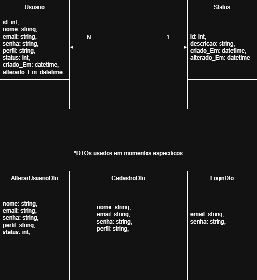

# Desenvolvimento da Aplicação

## Modelagem da Aplicação
Avaliação e Gestão de Usuário:<br>

- *Estrututura de dados no final do arquivo

Avaliação e Comentários:

- O diagrama de classes (DIAGRAMADAD.drawio) contém as classes Avaliação e Comentário, onde contém todos os atributos e funções que podem ser realizadas.

- A estrututura de dados são as duas entidades, nas quais o comentario representa uma resposta escrita feita por um usuário em relação a uma avaliação (e também uma determinada música), e a avaliação representa uma "avaliação" dada sobre uma música com suas características (por exemplo, a música, o texto da avaliação e a hora em que ocorreu).


## Tecnologias Utilizadas
### Backend 
- C# 
- API do spotify (para popular nossos dados)
- MySQL


## Programação de Funcionalidades
### Requisitos Atendidos
#### Requisitos Funcionais
|ID    | Descrição do Requisito  | Responsável | Artefato Criado | Estruturas de Dados | Teste/API | Atendido |
|------|-----------------------------------------|----|----|----|----|----|
|RF-001| A aplicação deve permitir cadastro de usuario | Yago | UsuariosController.cs | CadastroDto, Usuario | POST /api/Usuarios | ✅ |
|RF-002| A aplicação deve permitir deletar o usuario | Yago | UsuariosController.cs | Usuario | DELETE /api/Usuarios/{id} | ✅ |
|RF-003| A aplicação deve permitir alterar os dados do usuario | Yago | UsuariosController.cs | Usuario | PUT /api/Usuarios/{id} | ✅ |
|RF-004| A aplicação deve autenticar o login | Yago | UsuariosController.cs | LoginDto, Usuario | POST /api/Usuarios/login | ✅ |
|RF-005| A aplicação deve gerenciar a conexão a API do spotify | Gustavo/Vinicius | Artefato Criado | Estruturas de Dados | Teste/API | ❌ |
|RF-006| A aplicação deve permitir buscar por uma musica | Gustavo/Vinicius | Artefato Criado | Estruturas de Dados | Teste/API | ❌ |
|RF-007| A aplicação deve permitir o usuario a analisar uma musica | Daniel | Avaliação.cs| Avaliação | POST /api/Avaliacao | ✅ |
|RF-008| A aplicação deve permitir o usuario a deletar uma analise | Daniel | Avaliação.cs | Avaliação | DELETE /api/Avaliacao/{id} |✅ |
|RF-009| A aplicação deve permitir o usuario a comentar em uma analise | Daniel | Comentário.cs | Avaliação e Comentário | POST /api/Comentario | ✅ |
|RF-010| A aplicação deve permitir o usuario a deletar um comentario | Daniel | Comentário.cs | Avaliação e Comentário | DELETE /api/Comentario/{id} | ✅ |
|RF-011| A aplicação deve recomendar musicas | Carol | Artefato Criado | Estruturas de Dados | Teste/API | ❌ |
|RF-012| A aplicação deve recomendar analises | Carol | Artefato Criado | Estruturas de Dados | Teste/API | ❌ |
|RF-013| A aplicação deve recomendar perfis | Carol | Artefato Criado | Estruturas de Dados | Teste/API | ❌ |

#### Requisitos não Funcionais
|ID     | Descrição do Requisito  | Atendido |
|-------|-------------------------|----|
|RNF-001| A aplicação deve processar requisições do usuário em no máximo 3s | ✅ |
|RNF-002| A aplicação deve ser intuitiva para um uso simples | ✅ |

✅ - Atendido
❌ - Não Atendido

### Estrutura de Dados
#### Usuario
(src\Autenticação e Gestão do Usuário\Autenticacao_e_Gestao_do_Usuario\Models\Usuario) <br>
```js
{
  "id*": int,
  "nome*": "string",
  "email*": "string",
  "senha*": "string",
  "perfil": "string",
  "status": int,
  "criado_Em*": "datetime",
  "alterado_Em": "datetime"
}

- Os campos com `*` são obrigatórios.
- "perfil" deve ser "Usuario" ou "Administrador".
- "status" é um `int` que referencia uma linha da tabela `Status`.
- "criado_Em" e "alterado_Em" são definidos automaticamente pela API.
```

#### Status
(src\Autenticação e Gestão do Usuário\Autenticacao_e_Gestao_do_Usuario\Models\Status) <br>
```js
{
  "id*": int,
  "descricao*": "string",
  "criado_Em*": "datetime",
  "alterado_Em": "datetime"
}

- Os campos com `*` são obrigatórios.
- "criado_Em" e "alterado_Em" são definidos automaticamente pela API.
```

#### LoginDto
(src\Autenticação e Gestão do Usuário\Autenticacao_e_Gestao_do_Usuario\Models\DTO\LoginDto) <br>
```js
{
  "email*": "string",
  "senha*": "string",
}

- Os campos com `*` são obrigatórios.
```

#### CadastroDto
(src\Autenticação e Gestão do Usuário\Autenticacao_e_Gestao_do_Usuario\Models\DTO\CadastroDto) <br>
```js
{
  "nome*": "string",
  "email*": "string",
  "senha*": "string",
  "perfil": "string",
}

- Os campos com `*` são obrigatórios.
- "perfil" deve ser "Usuario" ou "Administrador".
```

#### AlterarUsuarioDto
(src\Autenticação e Gestão do Usuário\Autenticacao_e_Gestao_do_Usuario\Models\DTO\AlterarUsuarioDto) <br>
```js
{
  "nome*": "string",
  "email*": "string",
  "senha*": "string",
  "perfil": "string",
  "status": int,
}

- Os campos com `*` são obrigatórios.
- "perfil" deve ser "Usuario" ou "Administrador".
- "status" é um `int` que referencia uma linha da tabela `Status`.
```

#### Avaliação
(src\AvaliaçãoeComentáriosDAD\Avaliaçãoecomentários\Models\Avaliacao) <br>
```js

{
  "id*": int,
  "usuarioId*": int,
  "musica*": "string",
  "texto": "string",
  "dataCriacao*": "datetime",
  "comentarios": [ ]
}

-Os campos com * são obrigatórios.
-usuarioId referencia a tabela Usuario.
-comentarios representa uma lista de comentários vinculados à avaliação.
-dataCriacao é definido automaticamente pela API.
```

#### Comentários
(src\AvaliaçãoeComentáriosDAD\Avaliaçãoecomentários\Models\Comentario) <br>
```js

{
  "id*": int,
  "avaliacaoId*": int,
  "usuarioId*": int,
  "mensagem*": "string",
  "dataComentario*": "datetime"
}

-Os campos com * são obrigatórios.
-avaliacaoId referencia a avaliação à qual o comentário pertence.
-usuarioId indica o autor do comentário.
-dataComentario é definido automaticamente pela API.
```

#### Avaliação (Funções)
(src\AvaliaçãoeComentáriosDAD\Avaliaçãoecomentários\Controllers\AvaliaçãoController.cs) <br>
```js

{
[HttpGet] → Retorna todas as avaliações.  
[HttpGet("{id}")] → Retorna uma avaliação específica pelo ID.  
[HttpPost] → Cria uma nova avaliação.  
[HttpPut("{id}")] → Atualiza uma avaliação existente.  
[HttpDelete("{id}")] → Remove uma avaliação pelo ID.
}

-Utiliza o AppDbContext para acessar o banco de dados.
-Todas as ações são assíncronas (async).
-As respostas seguem os padrões HTTP (200 OK, 201 Created, 204 NoContent, 404 NotFound, 400 BadRequest).
```

#### Comentários (Funções)
(src\AvaliaçãoeComentáriosDAD\Avaliaçãoecomentários\Controllers\ComentárioController.cs) <br>
```js

{
[HttpGet] → Retorna todos os comentários.  
[HttpGet("{id}")] → Retorna um comentário específico pelo ID.  
[HttpPost] → Cria um novo comentário.  
[HttpPut("{id}")] → Atualiza um comentário existente.  
[HttpDelete("{id}")] → Remove um comentário pelo ID.
}

-Utiliza o AppDbContext para acessar o banco de dados.
-Todas as ações são assíncronas (async).
-As respostas seguem os padrões HTTP (200 OK, 201 Created, 204 NoContent, 404 NotFound, 400 BadRequest).
```


