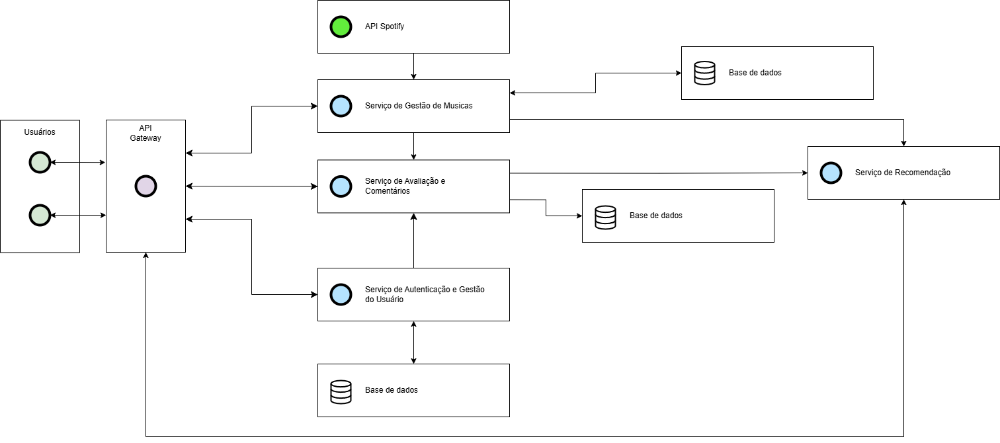

# Introdução

A música desempenha um papel essencial na vida das pessoas, influenciando emoções, criando conexões e moldando experiências. Com o crescimento das plataformas de streaming, os ouvintes dispõem de um extenso catálogo de músicas, porém frequentemente encontram obstáculos para descobrir novas canções que realmente se adequem aos seus gostos. A sugestão baseada apenas em algoritmos pode ser restrita, uma vez que não leva em conta as particularidades e vivências individuais de cada ouvinte. Neste cenário, fica clara a necessidade de um método mais interativo e colaborativo para sugestões musicais.

O principal desafio que procuramos solucionar é a ausência de uma plataforma especializada em recomendações musicais, onde os usuários possam avaliar músicas, trocar opiniões e interagir com outros entusiastas do gênero musical. Nossa proposta é criar uma plataforma que combina tecnologia e interação social para tornar a experiência de descoberta musical mais rica e personalizada.

O objetivo principal do projeto é desenvolver uma rede social de recomendação de músicas, onde os usuários possam atribuir notas, comentar e indicar faixas para amigos e outros membros da comunidade.

A justificativa para esse projeto reside na crescente demanda por experiências sociais no consumo de mídia digital. A interação social tem se mostrado um fator decisivo para o engajamento dos usuários em diversas plataformas, como demonstrado pelo sucesso de redes sociais voltadas ao compartilhamento de experiências e preferências. Com a criação desta ferramenta, buscamos preencher uma lacuna existente no mercado, promovendo não apenas a descoberta de novas músicas, mas também a interação significativa entre os ouvintes.

## Problema

A música é uma forma de expressão universal, que conecta as pessoas ao redor do mundo. No entanto, apesar da abundância de plataformas de streaming e redes sociais, não existe um espaço centralizado e focado exclusivamente na interação entre pessoas que querem compartilhar, avaliar e descobrir músicas de forma colaborativa.

Atualmente, os usuários recorrem a diferentes meios para expressar suas opiniões sobre músicas e álbuns, como comentários em vídeos, fóruns dispersos ou redes sociais generalistas, que não oferecem funcionalidades específicas para esse propósito. Isso fragmenta a experiência e dificulta a descoberta de novas músicas com base nas avaliações da comunidade.

Além disso, artistas independentes e novos talentos encontram dificuldades para alcançar um público engajado que valorize suas produções, já que as grandes plataformas priorizam artistas mais conhecidos ou dependem de algoritmos fechados para recomendações.

## Objetivos

O objetivo geral é desenvolver um software que servirá como uma rede social para quem gosta de músicas e serve para avaliar/recomendar músicas.

Objetivos específicos:

-Conectar pessoas através da música.

-Permitir que as pessoas compartilhem suas opiniões sobre músicas, álbuns e artistas para novas ideias.

-Ajudar as pessoas a encontrarem boas recomendações de músicas.

-Permitir com que as pessoas conversem sobre suas preferências musicais.

## Justificativa

A música desempenha um papel essencial na vida das pessoas, seja como forma de entretenimento, expressão pessoal ou conexão social. De acordo com um estudo da IFPI (International Federation of the Phonographic Industry), em 2023, as pessoas passaram, em média, 20,7 horas por semana ouvindo música, um aumento significativo em relação aos anos anteriores. No entanto, apesar desse consumo crescente, as formas de interação e compartilhamento musical ainda são limitadas a plataformas não especializadas ou com algoritmos que priorizam grandes artistas e dificultam a descoberta de novas músicas e talentos.

A ausência de um espaço digital voltado exclusivamente para a troca de opiniões, avaliações e recomendações musicais impacta tanto ouvintes quanto artistas independentes. Segundo dados da plataforma do Spotify, existem mais de 100 milhões de faixas disponíveis, mas estima-se que cerca de 80% das reproduções sejam concentradas em apenas 1% dos artistas. Isso evidencia um problema na descoberta de novas músicas, tornando difícil para ouvintes explorarem sons além das recomendações automatizadas.

A criação de uma rede social dedicada ao compartilhamento e avaliação de músicas atende a essa necessidade, permitindo que qualquer pessoa descubra novas faixas por meio de recomendações autênticas e interações diretas com a comunidade. Além disso, proporciona um ambiente mais acessível para artistas independentes divulgarem seu trabalho, democratizando o acesso à música e criando novas oportunidades para talentos emergentes.

Diante desse cenário, este projeto se justifica pela necessidade de um espaço colaborativo onde ouvintes e criadores possam se conectar de maneira mais orgânica, sem depender exclusivamente de algoritmos fechados ou de redes sociais generalistas que não foram projetadas para essa finalidade.

## Público-Alvo

O Melodify tem como público-alvo jovens e adultos entre 18 a 30 anos que residem no Brasil ou falam português, independentemente do nível de familiaridade com a tecnologia, pois a plataforma é acessível diretamente pelo navegador, oferece uma experiência simples e intuitiva. O único requisito é a paixão pela música. O Melodify é ideal para quem deseja recomendar, avaliar e interagir com outros usuários de gostos musicais semelhantes, proporcionando novas experiências de descoberta e compartilhamento musical.

# Especificações do Projeto

Definição do problema e ideia de solução a partir da perspectiva do usuário. Composta pela definição do diagrama de personas, histórias de usuários, requisitos funcionais e não funcionais além das restrições do projeto.

## Personas

### Persona 1 - Felipe Mendes (O Explorador Musical)
**Idade:** 25 anos  
**Profissão:** Arquiteto recém-formado e autônomo  

**Objetivos:**
- Explorar novos estilos musicais enquanto trabalha ou viaja
- Compartilhar suas opiniões sobre músicas  
- Encontrar recomendações musicais personalizadas  

**Desafios:**
- Falta de tempo para pesquisar novas músicas
- Dificuldade em encontrar recomendações certeiras  

**Funcionalidades mais relevantes:**  
- **Gestão de Músicas:** Buscar músicas e integração com o Spotify
- **Avaliação e Comentários:** Criar análises sobre músicas  
- **Recomendações:** Receber sugestões personalizadas  

### Persona 2 - Larissa Mendes (A Crítica Musical)
**Idade:** 30 anos  
**Profissão:** Jornalista musical e produtora de conteúdo  

**Objetivos:**
- Criar análises detalhadas sobre álbuns e singles
- Engajar com a comunidade musical  
- Receber recomendações baseadas no seu gosto  

**Desafios:**
- Encontrar uma plataforma para compartilhar críticas
- Manter um histórico organizado das suas análises  

**Funcionalidades mais relevantes:**  
- **Avaliação e Comentários:** Criar e deletar análises e comentários
- **Autenticação:** Manter um perfil confiável na plataforma  
- **Recomendações:** Descobrir novas músicas e críticas  

### Persona 3 - Gustavo Ferreira (O Desenvolvedor Entusiasta de IA)
**Idade:** 22 anos  
**Profissão:** Estudante de Ciência da Computação  

**Objetivos:**
- Explorar e contribuir para o sistema de recomendação musical
- Testar e otimizar algoritmos de recomendação  
- Criar perfis para testar personalizações  

**Desafios:**
- Encontrar métricas sobre o funcionamento do sistema
- Lidar com autenticação e gerenciamento da API do Spotify  

**Funcionalidades mais relevantes:**  
- **Recomendações:** Testar sugestões de músicas e perfis
- **Autenticação:** Criar contas para simulações  
- **Gestão de Músicas:** Analisar como os tokens da API são gerenciados  

### Persona 4 - Mariana Rocha (A Ouvinte Casual)
**Idade:** 35 anos  
**Profissão:** Gerente de Projetos  

**Objetivos:**
- Descobrir novas músicas rapidamente
- Ler avaliações antes de escolher playlists  
- Criar listas de músicas para diferentes momentos do dia  

**Desafios:**
- Falta de tempo para explorar novos estilos
- Evitar recomendações que não combinam com seu gosto  

**Funcionalidades mais relevantes:**  
- **Recomendações:** Receber sugestões diretas
- **Avaliação e Comentários:** Ler avaliações antes de escolher uma música  
- **Gestão de Músicas:** Buscar músicas por categorias e estilos

## Histórias de Usuários

Com base na análise das personas foram identificadas as seguintes histórias de usuários:

|EU COMO... `PERSONA` | QUERO/PRECISO ... `FUNCIONALIDADE`                 | PARA ... `MOTIVO/VALOR`                                    |
|---------------------|----------------------------------------------------|------------------------------------------------------------|
|Usuário do sistema   | Criar e excluir minha conta (CRUD)                 | Gerenciar meu acesso e dados pessoais                      |
|Usuário do sistema   | Fazer login na plataforma                          | Acessar meus dados e preferências                          |
|Usuário do sistema   | Criar, editar e excluir avaliações e álbuns (CRUD)          | Compartilhar minha opinião sobre músicas e álbuns |
|Usuário do sistema   | Comentar em avaliações de outros usuários e análises          | Compartilhar minha opinião                      |
|Usuário do sistema   | Seguir e deixar de seguir usuários                 | Acompanhar recomendações de pessoas com gostos similares   |
|Usuário do sistema   | Favoritar, criar e organizar músicas em playlists (CRUD)  | Acessar e organizar minhas descobertas musicais     |
|Usuário do sistema   | Receber recomendações personalizadas de músicas    | Descobrir novas músicas compatíveis com meu gosto          |
|Usuário do sistema   | Ter um perfil público com histórico de críticas    | Construir minha reputação na plataforma                    |
|Usuário do sistema   | Filtrar músicas por categorias e estilos           | Encontrar rapidamente o que desejo ouvir                   |

## Requisitos

As tabelas que se seguem apresentam os requisitos funcionais e não funcionais que detalham o escopo do projeto.

### Requisitos Funcionais

|ID    | Descrição do Requisito  | Prioridade |
|------|-----------------------------------------|----|
|RF-001| A aplicação deve permitir cadastro de usuario | ALTA |
|RF-002| A aplicação deve permitir deletar o usuario | MÉDIA |
|RF-003| A aplicação deve permitir alterar os dados do usuario | MÉDIA |
|RF-004| A aplicação deve autenticar o login | ALTA |
|RF-005| A aplicação deve gerenciar a conexão a API do spotify | ALTA |
|RF-006| A aplicação deve permitir buscar por uma musica | MÉDIA |
|RF-007| A aplicação deve permitir o usuario a analisar uma musica | ALTA |
|RF-008| A aplicação deve permitir o usuario a deletar uma analise | BAIXA |
|RF-009| A aplicação deve permitir o usuario a comentar em uma analise | MÉDIA |
|RF-010| A aplicação deve permitir o usuario a deletar um comentario | BAIXA |
|RF-011| A aplicação deve recomendar musicas | BAIXA |
|RF-012| A aplicação deve recomendar analises | MÉDIA |
|RF-013| A aplicação deve recomendar perfis | BAIXA |

### Requisitos não Funcionais

|ID     | Descrição do Requisito  |Prioridade |
|-------|-------------------------|----|
|RNF-001| A aplicação deve funcionar adequadamente em navegadores de dispositivos moveis e computadores | MÉDIA |
|RNF-002| A aplicação deve processar requisições do usuário em no máximo 3s |  BAIXA |
|RNF-003| A aplicação deve ser intuitiva para um uso simples |  MÉDIA |

## Restrições

O projeto está restrito pelos itens apresentados na tabela a seguir.

|ID| Restrição                                             |
|--|-------------------------------------------------------|
|01| O projeto deverá ser entregue até o final do semestre |
|02| Cada membro deve contribuir com pelo menos um serviço da API |
|03| Usar API do spotify como suporte a obtenção dos dados das musicas e não como uma ferramenta principal |

# Arquitetura da Solução

Imagem contendo como a interação do usuário com o sistema vai ser conduzida:

## Tecnologias Utilizadas

Vamos utilizar:
### Frontend 
- HTML
- CSS
- Javascript
- Bootstrap
- React
### Backend 
- C# 
- API do spotify (para popular nossos dados)
- MySQL

# Planejamento do projeto

## Divisão de papéis

### Sprint 1
- Documentação: Carolina, Daniel, Gustavo, Vinicius e Yago

### Sprint 2
- _Scrum master_: Gustavo
- Front-end: (Extra, caso seja possível)
- Gestão de músicas: Gustavo, Vinicius
- Recomendação: Carolina
- Avalição e Comentários: Daniel
- Autenticação e Gestão do Usuário: Yago
- Base de dados: Carolina, Daniel, Gustavo, Vinicius e Yago

### Sprint 3
- _Scrum master_: Yago
- Tester _front-end_: Gustavo
- Tester _back-end_: Carol, Daniel, Vinicius e Yago

## Quadro de tarefas

### Sprint 1

Atualizado em: 23/03/2025

| Responsável   | Tarefa/Requisito | Iniciado em    | Prazo      | Status | Terminado em    |
| :----         |    :----         |      :----:    | :----:     | :----: | :----:          |
| Gustavo        | README introdutório | 07/03/2025 | 07/03/2025 | ✔️ | 07/03/2025 |
| Daniel        | Objetivos | 07/03/2025 | 07/03/2025 | ✔️ | 07/03/2025 |
| Carolina       | Problema | 07/03/2025 | 07/03/2025 | ✔️ | 07/03/2025 |
| Carolina       | Justificativa | 07/03/2025 | 07/03/2025 | ✔️ | 07/03/2025 |
| Vinicius       | Introdução | 07/03/2025 | 07/03/2025 | ✔️  | 07/03/2025 |
| Yago      | Público-Alvo | 07/03/2025 | 07/03/2025 | ✔️  | 07/03/2025 |
| Todos do Grupo     | Requisitos Funcionais | 14/03/2025 | 14/03/2025 | ✔️  | 14/03/2025 |
| Todos do Grupo      | Requisitos Não Funcionais | 14/03/2025 | 14/03/2025 | ✔️  | 14/03/2025 |
| Yago      | Restrições | 14/03/2025 | 14/03/2025 | ✔️  | 14/03/2025 |
| Daniel e Vinicius      | Personas | 14/03/2025 | 14/03/2025 | ✔️  | 14/03/2025 |
| Carolina      | Histórias de Usuário | 14/03/2025 | 14/03/2025 | ✔️  | 14/03/2025 |
| Yago      | Tecnologias Utilizadas | 21/03/2025 | 23/03/2025 | ✔️  | 23/03/2025 |
| Gustavo      | Divisão de Papéis | 21/03/2025 | 23/03/2025 | ✔️  | 22/03/2025 |
| Vinicius      | Quadro de Tarefas | 21/03/2025 | 23/03/2025 | ✔️  | 23/03/2025 |
| Daniel      | Processos | 21/03/2025 | 23/03/2025 | ✔️  | 23/03/2025 |
| Yago      | Ferramentas | 21/03/2025 | 23/03/2025 | ✔️  | 23/03/2025 |
| Carolina      | Gerar Tarefas no Github Projects | 21/03/2025 | 23/03/2025 | ✔️  | 23/03/2025 |

### Sprint 2

Atualizado em: 02/05/2024

| Responsável   | Tarefa/Requisito | Iniciado em    | Prazo      | Status | Terminado em    |
| :----         |    :----         |      :----:    | :----:     | :----: | :----:          |
| Daniel        | Avaliação   | 11/04/2025     | 01/06/2025 | 📝    |                 |
| Daniel        | Comentários    | 11/04/2025     | 01/06/2025 | 📝    |                 |
| Yago       | Autenticação  | 10/05/2025     | 01/06/2025 | 📝     |                 |
| Yago        | Gestão de Usuários  |  11/04/2025    | 01/06/2025 | ✔️    |                 |
| Gustavo e Vinicius       | Gestão de músicas    | 30/04/2025 | 01/06/2025 | ⌛    |                 |
| Carol       | Recomendação de músicas    | - | 01/06/2025 | 📝    |                 |
| Todos do grupo        | Base de dados   | 11/04/2025     | 01/06/2025 | 📝    |                 |

Legenda:
- ✔️: terminado
- 📝: em execução
- ⌛: atrasado
- ❌: não iniciado

## Processo

Para garantir um desenvolvimento ágil e eficiente, o grupo utilizará a metodologia Scrum, uma estrutura de trabalho iterativa e incremental que facilita a colaboração entre os membros da equipe. O Scrum será aplicado ao longo do ciclo de desenvolvimento do projeto, permitindo adaptações conforme necessário.

Papéis e Responsabilidades:

Product Owner (PO): Responsável por definir e priorizar os requisitos do produto, garantindo que o backlog do produto esteja alinhado com os objetivos do projeto.

Scrum Master: Facilita a adoção do Scrum, removendo impedimentos e garantindo que as boas práticas sejam seguidas.

Equipe de Desenvolvimento (Front-end e Back-end): Composta por desenvolvedores, designers e outros profissionais necessários para a construção da solução.

Eventos do Scrum:

Sprint Planning: Reunião no início de cada sprint para definir quais tarefas serão abordadas com base na prioridade e complexidade.

Week Planning: Reunião a cada semana para definir e entender como está a situação e o que pode ser feito.

Uso do GitHub para Gerenciamento do Projeto:

O grupo fará uso do GitHub Projects, uma ferramenta integrada ao repositório do projeto, para acompanhar o progresso do desenvolvimento, execução de tarefas e status da solução. (Kanban)

Estrutura do Gerenciamento no GitHub:

Backlog: Listagem de todas as tarefas do projeto organizadas por prioridade.

To Do: Tarefas pendentes para a sprint atual.

In Progress: Tarefas em desenvolvimento.

Review: Tarefas que estão sendo revisadas.

Done: Tarefas concluídas.

## Ferramentas

| Ambiente                            | Plataforma                         | Link de acesso                         |
|-------------------------------------|------------------------------------|----------------------------------------|
| Repositório de código fonte         | GitHub                             | https://github.com/ICEI-PUC-Minas-PCO-SI/pco-si-2025-1-dad-g3-melodify                           |
| Documentos do projeto               | GitHub                             | https://github.com/ICEI-PUC-Minas-PCO-SI/pco-si-2025-1-dad-g3-melodify/tree/docs/docs                            |
| Projeto de interface                | Figma                              | https://www.figma.com/design/kRvH34zU5HpzjFQtRb0gGa/Melodify?t=vvbUfOVauUfrx0rb-1           |
| Gerenciamento do projeto            | GitHub Projects                    | https://github.com/ICEI-PUC-Minas-PCO-SI/pco-si-2025-1-dad-g3-melodify/projects?query=is%3Aopen                            |
| Hospedagem                          | Vercel                             | http://....                            |
